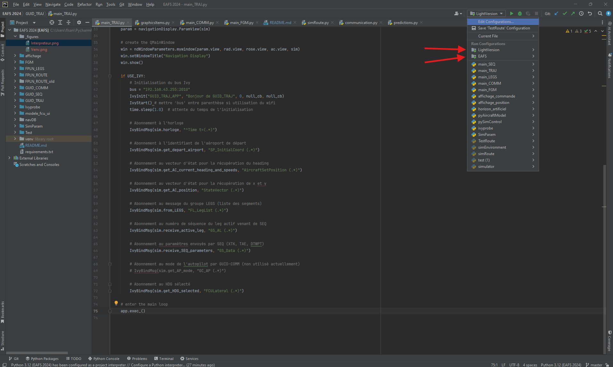

# Introduction
Ce dépot est la partie logicielle attachée au projet EAFS.

L'intégralité du code est en python et s'execute dans un environment de développement Pycharm.

La version testée actuellement est [PyCharm](https://www.jetbrains.com/fr-fr/pycharm/download/) 2024.1.6 (Community Edition) 
et la version de python est [Python](https://www.python.org/) 3.12.

Une fois la suite logicielle installée, vous pouvez télécharger le projet sous format zip.

Décompressez l'archive dans le dossier de projet PycharmProjects puis l'ouvrir dans Pycharm.

# Configuration de l'interpréteur du projet.
Ouvrir le fichier simRoute.py. Un bandeau similaire à la figure 1 doit vous proposer d'installer l'environment virtuel, 
ainsi que les dépendances du projet.

<figure>

<figure-caption>Figure 1. Première ouverture du projet.</figure-caption>

</figure>

Après avoir cliqué sur le lien indiqué par la flèche rouge sur l'image 1, vous obtenez la fenêtre pop-up de la figure 2.

<figure>

<figure-caption>Figure 2. Fenêtre pop-up environment virtuel et dépendance.</figure-caption>

</figure>
Ne pas modifier l'emplacement. Allez chercher l'interpréteur de base à l'emplacement de l'installation de python 3.12 et validez.

Votre installation est maintenant complète.

# Architecture du projet
Le projet est basé sur un ensemble de modules écrits en python qui communiquent entre eux au travers d'un bus de communication réseau [IVY](https://www.irit.fr/~Philippe.Truillet/zilab/madagascar/supports/ivy.3.1.pdf).
Pour faire fonctionner le simulateur, il est donc nécessaire de lancer simultanément plusieurs codes, chacun fournissant une ou plusieurs fonctionnalités. 

Un tableau résume les principales communications. Plus de détails seront obtenus en lisant les documents à votre disposition.

# Exécution
Pour simplifier l'exécution de l'ensemble des modules, Pycharm propose la notion de "Compound" qui permet d'exécuter un
ensemble de fichiers avec une seule action. Deux configurations vous sont proposées : "LightVersion" qui ne comprend pas les
affichages de commande, de l'horizon artificiel et de la position de l'avion, et "EAFS" qui est le simulateur complet.
<figure>

<figure-caption>Figure 3. Exécution du simulateur.</figure-caption>

</figure>

Nous allons vous guider pour lancer une
première simulation de vol de LFBO (Toulouse Blagnac) à LFPO (Paris Orly).

Lors de l'exécution de la version légère, trois fenêtres vont s'ouvrir.
<figure>

<figure-caption>Figure 4. Fenêtres de simulation.</figure-caption>

</figure>
En haut à gauche, vous avez l'interface du "Navigation display". Cette interface graphique va représenter la route ainsi 
que la position de l'avion par rapport à cette dernière. Cette interface graphique est liée au module GUID_TRAJ.
La fenêtre à droite permet de lancer le temps de simulation (ainsi que de le mettre en pause) et de voir l'état du modèle avion.

Attention : il se peut que le modèle avion ne se lance pas correctement : vous devez avoir les boutons verts (INIT) et rouges
(RESET) d'actifs sinon, arrêtez tous les modules pour les relancer.

Réglez la vitesse sur 1 et les intervalles sur 0.1s et appuyez sur le bouton start comme sur la figure 5.
<figure>

<figure-caption>Figure 5. Réglage du temps de simulation.</figure-caption>

</figure>
A partir de ce moment, ce module envoie un message sur le bus Ivy de la forme "Time t=4.0". Ce message sera utilisé par 
de nombreux modules comme base de cadencement. Vous pouvez observer l'ensemble des messages envoyés sur le bus au travers
du terminal ivyprobe de Pycharm (voir figure 6). Vous observez aussi l'ensemble des terminaux d'exécution des modules sur la même ligne.
Ces derniers peuvent vous permettre de lancer des commandes dans chaque module ou d'effectuer de l'affichage.

<figure>

<figure-caption>Figure 6. Terminal ivyprobe monitorant l'ensemble des messages échangés sur le bus IVY.</figure-caption>

</figure>

Maintenant, vous pouvez entrer l'aéroport de départ dans la fenêtre SimParam (fenêtre au milieu en bas de la figure 4). 
Cette interface, du module du même nom, est conçue pour représenter le point d'entrée de données de simulation.
Ainsi, vous pouvez définir que votre avion se situe à LFBO comme sur la figure 7. En validant par entrée, le texte doit
s'afficher en vert si l'aeroport de départ est trouvé dans la base de données. 
<figure>

<figure-caption>Figure 7. SimParam : définition de l'aéroport de départ.</figure-caption>

</figure>

Une fois cette étape réalisée, vous pouvez exécuter le code simRoute.py, qui simule le module FPLN_ROUTE. Une fois le
message envoyé, le ND doit afficher la trajectoire et le button de SimParam devient actif. Vous pouvez lancer le vol en
appuyant sur Start (Figure 7).

Pour arrêter le simulateur, vous devez cliquer sur le button indiqué sur la figure 8. Plusieurs appuis peuvent être 
nécessaires pour arrêter tous les process.
<figure>

<figure-caption>Figure 8. Stop simulation.</figure-caption>

</figure>
